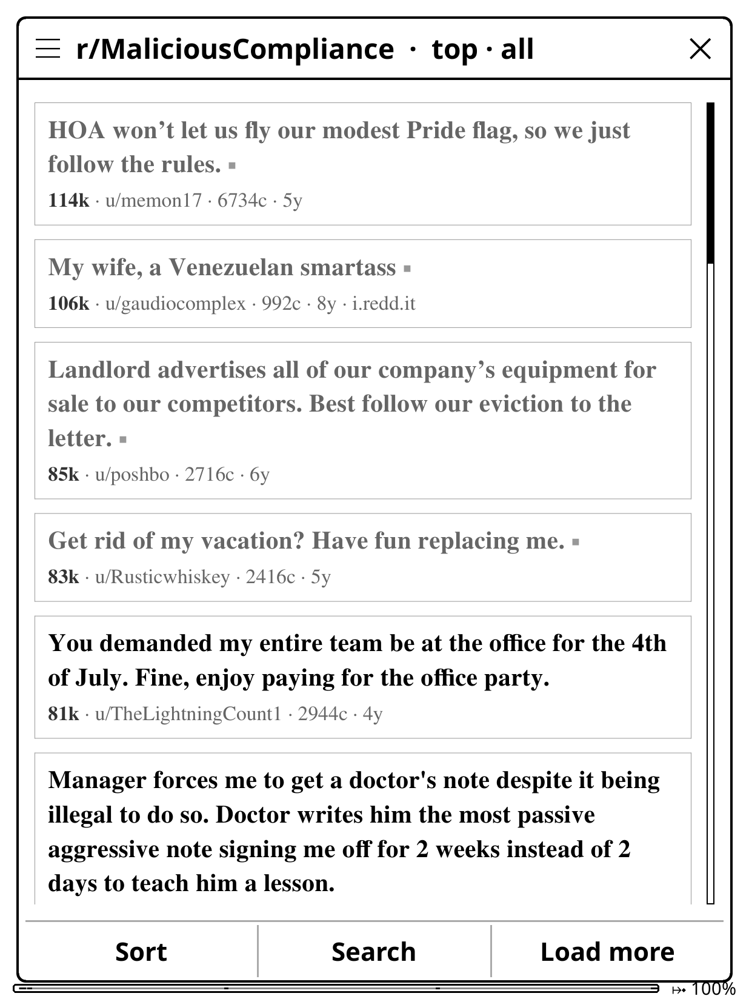
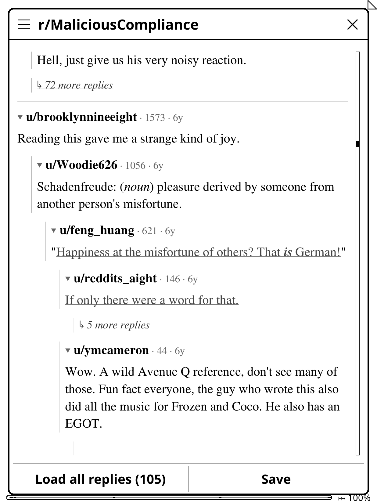
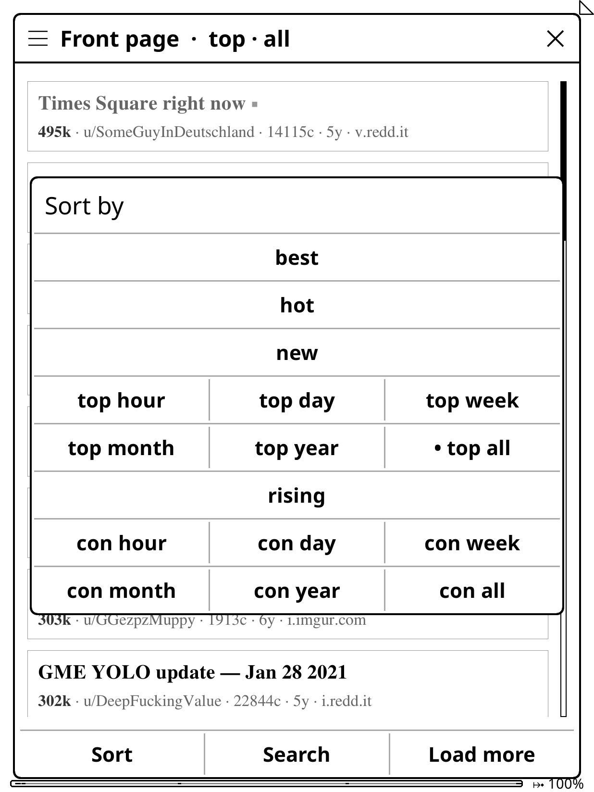
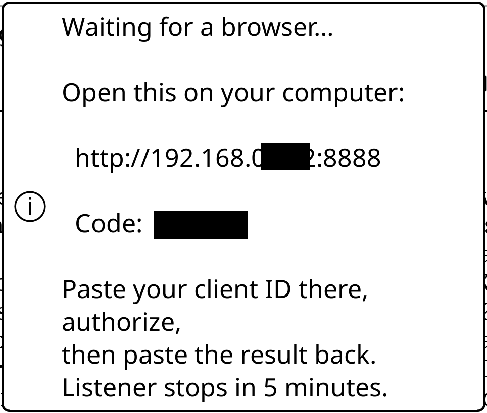
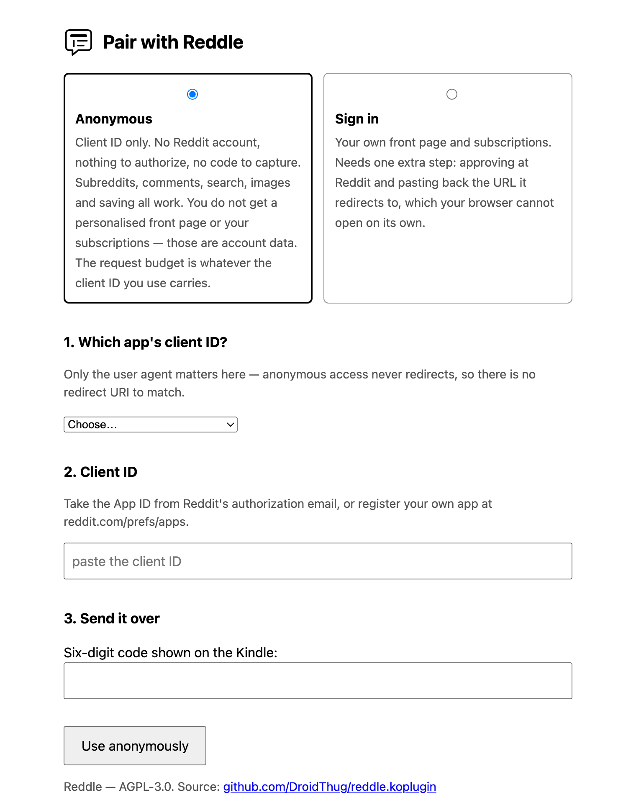
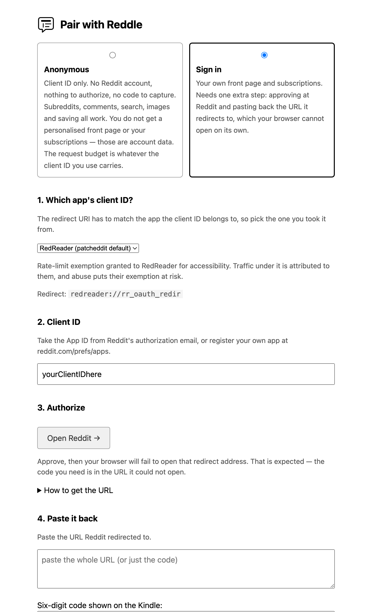
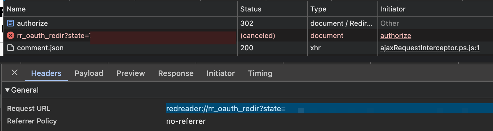
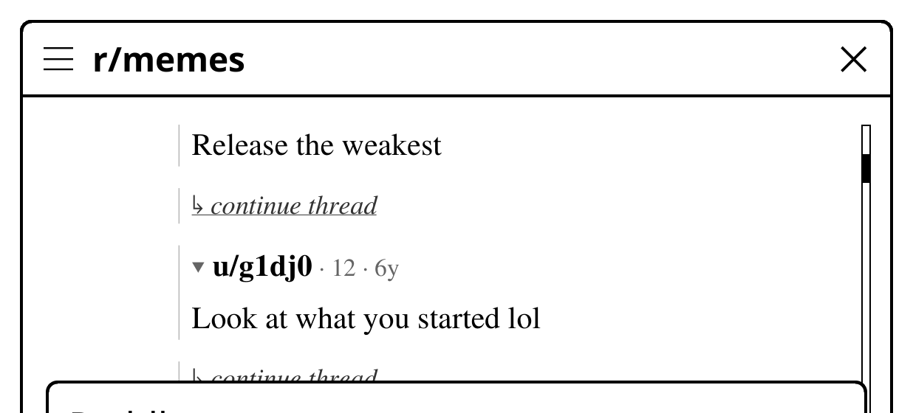

# Reddle for Reddit

Reddle is a read-only Reddit client plugin for any device running [KOReader](https://github.com/koreader/koreader). It renders natively through KOReader’s MuPDF-backed HTML widget, providing a seamless, distraction-free reading experience.
  - See [Scope](#scope).

<p align="center">
  
  
  
</p>

A subreddit with read markers · a thread, foldable · sort and time window.

## Features

- Front page (user/anonymous) / any subreddit, with sort and search options
- Threaded comments - collapsible (similar)
- Markdown rendering: supported (with optional emojis) - if there’s any textual/rendering discrepancies do make an issue
- Images open in KOReader's image viewer - on-demand - no thumbnails / prefetching done - cached temporarily
	- By default Reddle downloads the smallest of Reddit's own previews.
    - If you prefer higher quality images -> **Settings and about → Images → Original size** turns that off.
- Reddit links work internally but anything external offers a QR code.
- Save posts for offline reading. Grouped by subreddit.
- Posts you have opened are marked in the listing, so you can tell at a glance what is
  new since last time.

## Requirements

- Any device KOReader runs on: Kobo, Kindle, reMarkable, PocketBook, Android, or a
  desktop. Developed and used daily on a jailbroken Kindle Paperwhite 5, so that is the
  only device every screen has been checked on.
- A KOReader build whose `TextViewer` supports `text_format` (anything newer than
  v2026.03). Older builds work, but fall back to structured plain text: you lose
  indentation on wrapped lines, real headings, and the quieter byline styling.
- A computer on the same network with a browser, to pair once.
- A Reddit API client ID — see [Getting a client ID](#getting-a-client-id). A Reddit
  *account* is only needed if you want a personalised front page.

## Install

Download `reddle.koplugin.zip` from
[Releases](https://github.com/DroidThug/reddle.koplugin/releases) and unzip it into
`koreader/plugins/` on the device:

```sh
# over USB
unzip reddle.koplugin.zip -d /path/to/koreader/plugins/

# or over SSH, if your jailbreak includes USBnet or sshd
scp reddle.koplugin.zip root@DEVICE_IP:/tmp/
ssh root@DEVICE_IP 'unzip -o /tmp/reddle.koplugin.zip -d /path/to/koreader/plugins/'
```

To run from a checkout instead, clone the repository *as* the plugin directory — this
repository's root is the plugin:

```sh
git clone https://github.com/DroidThug/reddle.koplugin \
  /path/to/koreader/plugins/reddle.koplugin
```

Restart KOReader afterwards. Reddle appears under **Tools**.

## Getting a client ID

Reddit's API needs a registered client. Reddle ships none and never will — one published
on GitHub gets scraped, then revoked, and everyone relying on it breaks at once.

> [!IMPORTANT]
> New client IDs go through manual review by Reddit.
>
> **Do not delete one you already have** — they are sometimes revoked without warning.

### Your own

Any app you registered before is still editable: at <https://www.reddit.com/prefs/apps>,
set its redirect URI to `http://localhost:8080` and press **update**. Or make a new one —
**create another app…**, type **installed app**, same redirect URI.

Pick **My own registration** when pairing.

The redirect URI only has to match exactly, so anything works if both ends agree. But
`localhost` is worth keeping: the browser follows it, fails to connect, and leaves the
code in the address bar — no [DevTools](#signing-in) needed.

### Borrow one

Take the App ID of an app that already has a registration:

1. Install the real app — RedReader on Android, Dystopia on iOS — and log in.
2. Reddit emails you *"You've authorized a new app in your Reddit account"*. The **App
   ID** in it is the client ID.
3. You may keep the app if you like; the client ID keeps working even if uninstalled.
4. When pairing, pick the app you took it from — that sets the matching user agent and
   redirect URI.

| identity | user agent | redirect |
|---|---|---|
| `own` | yours | `http://localhost:8080` |
| `redreader` | `org.quantumbadger.redreader/1.25.1` | `redreader://rr_oauth_redir` |
| `dystopia` | `ios:com.CarbonDev.Dystopia:v1.0.1…` | `dystopia://response` |

- **RedReader's** and **Dystopia's** developers have a special deal with Reddit to use
  the API for free due to accessibility reasons. Traffic under their client ID is
  attributed to them, so abuse risks that deal for the people who depend on it.
- Move to your own client ID if you ever get one.

## Get Started

Getting the client ID onto the device is the only fiddly part, and there are two routes.

1. On the e-reader: **Tools → Reddle → Account → Pair…**. It shows an address and a
   one-time code, then listens for five minutes.

   <p align="center"></p>

2. Open that address in a browser on the same network, pick a mode, and paste the
   client ID.

<table>
<tr>
  <th width="50%">Anonymous</th>
  <th width="50%">Sign in</th>
</tr>
<tr>
  <td></td>
  <td></td>
</tr>
<tr>
  <td>Paste, enter the code, press <b>Use anonymously</b>. Done.</td>
  <td>Also needs approving at Reddit and pasting back the URL it redirects to.</td>
</tr>
<tr>
  <td>Reddit's default front page.</td>
  <td><b>Your</b> front page and subscriptions.</td>
</tr>
<tr>
  <td colspan="2" align="center">Subreddits, comments, search, images and saving work either way.</td>
</tr>
</table>

**Start anonymous** unless you want a personalised front page. You can sign in later
without re-pasting anything.

### Signing in

**Open Reddit** and approve. Reddit redirects to `yourapp://callback?state=…&code=…`,
which your browser cannot open unless that app is installed — expected, and the code
you need is in the URL it refused.

With your own registration the code is already in the address bar and you are done.
A borrowed one redirects to a scheme the browser cannot open, so **read it from
DevTools** — Chromium-based browsers and Firefox (Safari unsupported for this workflow):

1. Open DevTools (**F12**) **before** approving, and go to **Network**.
2. Tick **Preserve log**.
3. Approve. Find `authorize` — status **302** — and the cancelled `rr_oauth_redir` row
   under it.
4. Click that row and copy the **Request URL** in full.

<p align="center"></p>

Paste it back with the six-digit code. The device finishes the sign-in itself, and the
credentials persist until you revoke the token or reset the device.

> **Copy and paste, never retype.** macOS's "no application set to open the URL" dialog
> hyphenates at the line wrap, and Reddit's codes contain real hyphens — a retyped code
> is silently wrong.


<details>
<summary><b>Advanced:</b> macOS app / pairing from the command line</summary>

For networks that block devices from reaching each other, where the page never loads.
Sign-in only — use the page for anonymous.

```sh
export REDDLE_CLIENT_ID=...
export REDDLE_IDENTITY=redreader     # only if the client ID came from another app

# 123456 is the code on the pairing screen. Prints a URL; approve it.
./tools/reddle-bridge.sh auth --device 192.168.1.42:8888 --code 123456

# then hand back whatever you captured
./tools/reddle-bridge.sh "redreader://rr_oauth_redir?state=...&code=..."
```

- The second command reuses what `auth` saved in `~/.config/reddle/config`.
- Run it with no argument to paste at the prompt. It takes the whole URL, the query
  string, or a bare `code=`.
- Without `REDDLE_IDENTITY` it authorises against `http://localhost:8080`.

Needs `bash` and `curl`.

</details>

## The menu

```
Tools → Reddle
├── Front page
├── Go to subreddit…            remembers the last one
├── Saved (n)                   All, then one entry per subreddit
├── Account
│   ├── Check login             username (if logged in) and remaining API budget
│   ├── Pair…                   starts the pairing listener
│   ├── Pairing port: 8888      configurable
│   └── Log out                 clears credentials, keeps saved posts - does not remove CLIENT ID
└── Settings and about
    ├── Images                  toggles save as downscaled or original size
    ├── Offline save limit      requests one saved thread may spend
    ├── Clear read markers (n)
    ├── Rendering test          what this device's MuPDF actually honours
    └── About Reddle            version, identity, archive/cache size
```

<p align="center"></p>

The same menu sits behind the title-bar icon on every screen, so you can get anywhere
from inside a thread. KOReader's display settings are one row below it.

Front page, **Go to subreddit** and **Saved** are KOReader actions too — bind them to a
gesture under *Taps and gestures*.

Long-press a post in any listing to save it; long-press a saved one to remove it or
fetch what is missing.

Threads arrive capped, so saving one offers to fetch the rest — about one request per 40
replies. **Offline save limit** caps that spend (zero never fetches); anything left over
is recorded, and **Fetch missing** finishes it later.

## Emoji (optional)

KOReader's fonts are chosen for prose, so emoji coverage is incidental — on a
Paperwhite 5, 🔥 and 💀 render while 📌 😀 👍 🚀 🏆 do not, and a missing glyph draws as
nothing at all. Reddle substitutes the known-missing ones (`[rocket]`, `[+1]`, `:)`).
For the real thing:

```sh
./tools/install-emoji-font.sh /path/to/koreader
# or
./tools/install-emoji-font.sh root@DEVICE_IP:/path/to/koreader
```

Monochrome Noto Emoji (~1.9 MB, OFL-1.1), used for emoji only. Restart KOReader
afterwards; to undo, delete `koreader/fonts/emoji/`.

## Scope

Reddle does not vote, comment, post or subscribe, and there are no plans to. The
engagement loop is the part worth leaving behind; the reading is what an e-reader is
for. It also keeps the OAuth scopes narrow enough to leave paired safely.

Bug reports and feature/pull requests are welcome

## Roadmap

- [ ] **Signing in from a phone.** Anonymous already works anywhere; capturing the
      authorization code needs DevTools or a registered URL scheme.
- [ ] **Subscriptions.** A list of your subscribed subreddits, alongside the front page.
- [ ] **Comment sorting.** Reddit's default is the only option today.
- [ ] **Saving a whole subreddit** in one action, rather than a post at a time.
- [ ] **Saved post storage management** — currently requires per-post deletion.

## Storage

| Path | Bounded by | Survives |
|---|---|---|
| `settings/reddle.lua` | 500 read markers | everything except **Log out** |
| `settings/reddle_saved/` | Saved posts - stored as JSON | Removed per post |
| `cache/reddle/` | 20 MB, oldest auto-deleted first | cleared by deleting the directory |
| fetched threads | 10 minutes, 6 threads, in memory | stored in RAM |

The saved posts is the only thing that may build depending on how much you save.
**Settings and about → About Reddle** shows the current figures.

## Security

Worth knowing before you install this:

- **The refresh token is a full account credential.** It does not expire on its own, and
  it is stored in plaintext in KOReader's settings directory, on a partition that mounts
  over USB. Anyone with physical access to the device can read it. An e-reader has no
  keystore, so there is nowhere better to put it.
- You can revoke it at any time at <https://www.reddit.com/prefs/apps>, which takes
  effect immediately. Pair again afterwards.
- **Scopes are narrow**: `identity read mysubreddits history`. Read-only, and they stay
  that way — see [Scope](#scope).
- **Pairing opens a port on your local network** for at most five minutes. It requires a
  one-time code, never logs the payload, and closes on the first successful pair.
- Secrets are read from the environment or a config file, never from command-line
  arguments, so they do not end up in your shell history.
- **Every request presents the chosen identity**

## Translations


```sh
luajit tools/extract-strings.lua       # regenerate l10n/TEMPLATE.lua
cp l10n/TEMPLATE.lua l10n/de.lua       # then fill in the right-hand sides
```

French, Spanish, Portuguese and German are machine-drafted, so corrections from native speakers are welcome. 

Name new ones after KOReader's language code (`it`, `nl`, `zh_CN`); Empty values use the English, so partial translations are worth sending, and anything Reddle does not translate falls through to KOReader's own catalogue.

## Development

The repository root is the plugin: `main.lua`, `_meta.lua` and the `reddle_*` modules
sit at the top level so a clone can be dropped straight into `koreader/plugins/` as
`reddle.koplugin`. `spec/`, `tools/` and `assets/` are development-only and are left out
of the release zip.

No dependencies beyond `luajit`. The test harness is written from scratch, because
neither busted nor luarocks is available on an e-reader toolchain.

```sh
luajit spec/run.lua              # unit specs
luajit spec/run.lua listing      # a single file
bash spec/bridge_spec.sh         # shell specs for the pairing script
bash spec/koreader_api_check.sh  # verify every KOReader API the plugin calls exists
luajit spec/screens.lua          # render every screen as ASCII
```

`koreader_api_check.sh` matters most: the unit specs fake KOReader, so a call to a
method that does not exist passes every test and then crashes the reader. Point it at
the build you deploy to:

```sh
KOREADER_SRC=/path/to/koreader bash spec/koreader_api_check.sh
```

`spec/live_test.sh` exercises the real API against your account. It is read-only by
design and never votes, saves, submits, edits or subscribes.

## Credits

- **[KOReader](https://github.com/koreader/koreader)**
- **[patcheddit](https://github.com/patcheddit)**
- Emoji rendering uses **Noto Emoji** (SIL Open Font License 1.1), installed separately
  by `tools/install-emoji-font.sh`
- Built with **Claude Opus 5** (Anthropic), which wrote most of the code and specs to
  direction. Per-commit attribution is in the git history.

## Licence

AGPL-3.0. See [LICENSE](LICENSE).

